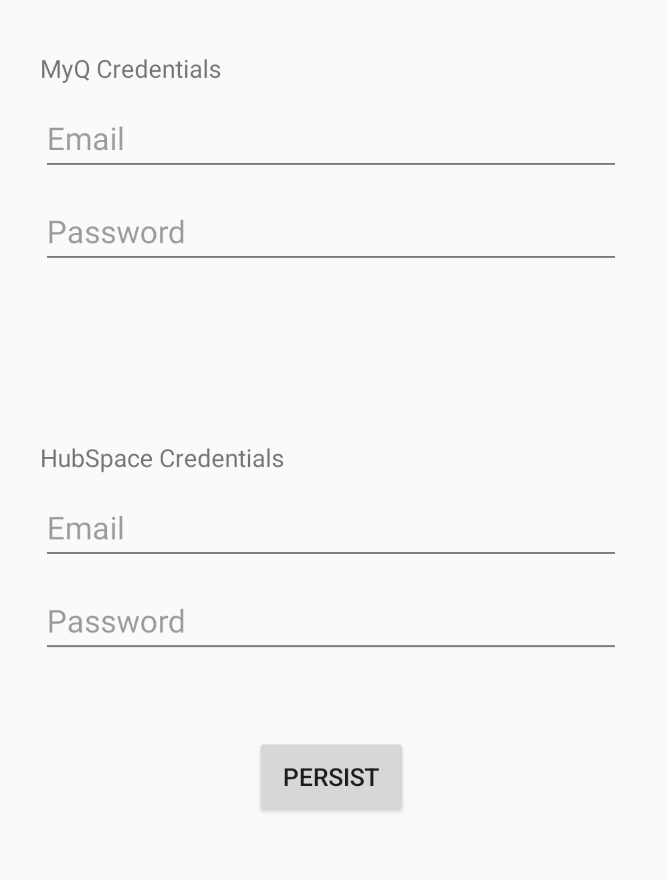
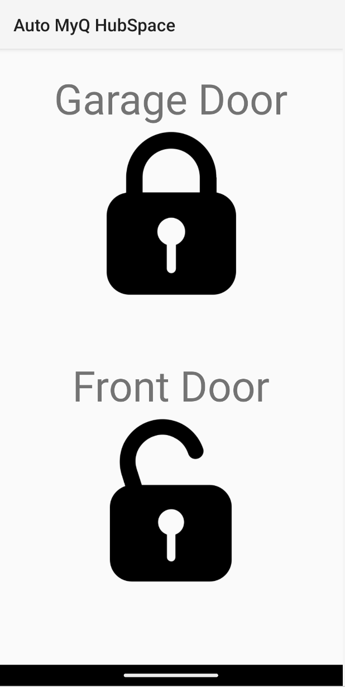
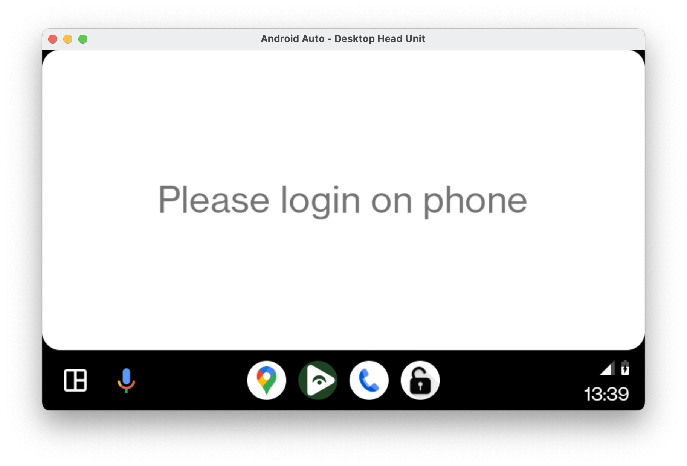
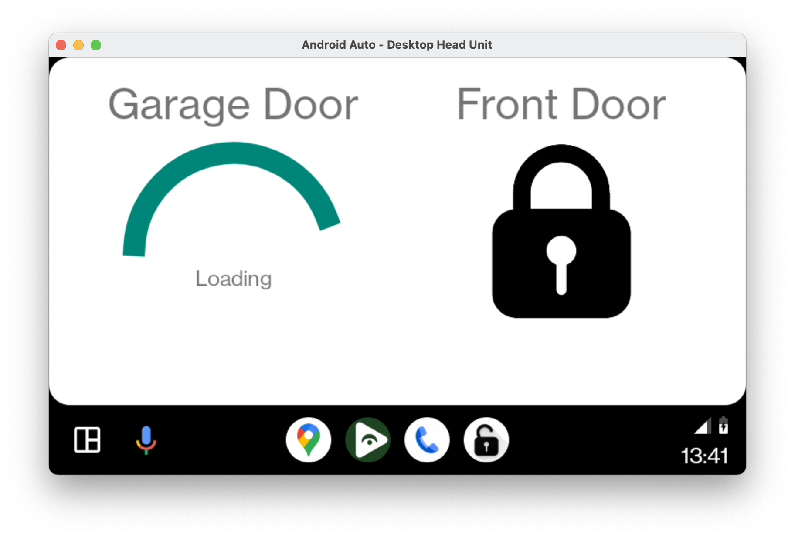

# Auto MyQ HubSpace

A simple app to show if Garage Door via MyQ and Front Door via HubSpace are locked/unlocked.

Admittedly, this is probably a very limited application for others. There is probably a developer 
out there who could make this app more configurable for more locks and smart-lock services. For me, 
this is what I wanted and it works. Happy developing.

## Works with Android Auto

## Credit to:
 - [jdeath/Hubspace-Homeassistant](https://github.com/jdeath/Hubspace-Homeassistant)
 - [rushiiMachine/myq](https://github.com/rushiiMachine/myq)
 - [AndreyPavlenko/Fermata](https://github.com/AndreyPavlenko/Fermata)